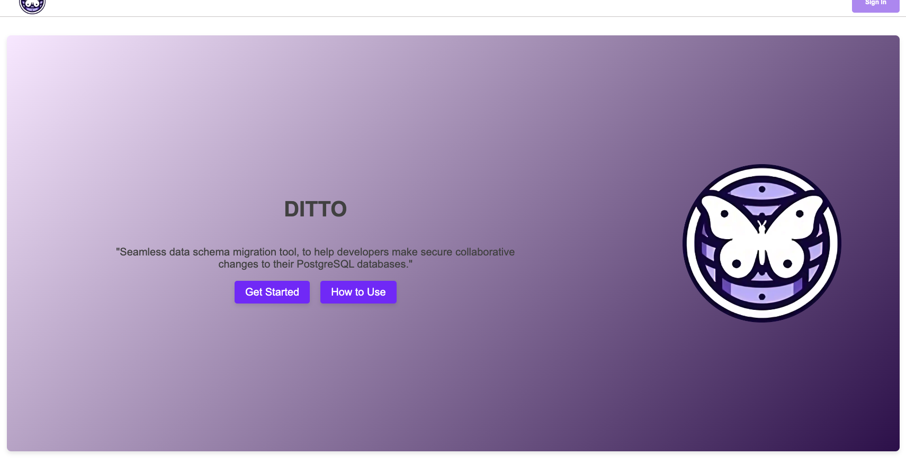

# Table of Contents
- Ditto README.md
    - [Product Description](#product-description)
    - [Instruction](#instructions)
    - [Open Source Information](#open-source-information)

# Product Description
Ditto is a powerful database schema migration tool designed for developers to collaborate effectively and manage database changes seamlessly. It helps you track and organize schema migration scripts, ensuring your databases remain functional and your applications run smoothly before they hit production.

With Ditto, you can manage multiple projects and databases within each project, providing a clear visual interface for engineers to monitor schema migrations. This tool is ideal for teams needing to maintain and verify database changes, making sure everything works perfectly before going live.

  

  
  

  

  
  

  

  
  

# Important Feautures
- Version Control
- Multiple projects and databases
- Role Based Access
- Code Editor has built in intellisense for writing SQL Scripts

# Instructions
Installation

- No installation necessary (Web Browser App)

Initial Setup 
1. Sign up for an account by clicking "Get Started" or log in through Github!
2. Proceed to the Projects tab.

Creating a Project and Connecting Your Databases (Only Owners and Admins Can Connect Databases to a Project)
1. In the left side panel on the projects page, click the buttons underneath "Choose Project" to create a new project.
2. Select the "Migrations" tab in the top navigation bar and press the database icon to create a new database. Enter your connection string and database name, then click the "Add"    button.
3. Congratulations, your database is good to go!

Adding Members, Removing Members and Updating Roles for Members.
(Only Owner and Admin roles will have these functions)
1. Adding team members:
    a. In the projects page, after selecting a project, you can click generate and an access code will be stored to that specific project. *** Only Owner and Admin roles will be          able to generate access codes ***
    b. Give the code to members you want to give access to your project and its databases.
    c. Members will now sign up on Ditto as well and when they get to the projects page, they will click join project and enter the access code.
    d. If successful, they should be able to see the project and see themselves as "User" role.

2. Removing project members:
    a. Select your project and press the Remove User button in the Role column.

3. Updating project member roles:
    a. Select your project, then use the drop-down menu to assign roles to the corresponding users.

Adding, Updating and Deleting Migration Scripts.
1. Adding:
    a. On your migrations page, click the "Add" button above the migration scripts table.
    b. On the add migrations page, enter your version, description, and script in the code editor. When you're ready, click "Add."
    c. Your newly created migration should appear with a pending status (it will only execute when you're ready).

2. Updates:
    a. If you want to make any updates to the version, description, or script, highlight the specific migration script you'd like to edit (it should turn purple) and press the            edit icon underneath the code editor.
    b. This will take you to the updates page where you can make your changes.

3. Delete:
    a. If there are any migration scripts you want to delete, you can highlight by clicking a migration script and press the delete button under the code editor.

4. Execute:
    a. Once you're ready to execute your scripts, click the button under the dropdown in the Actions table.
    b. This will proceed to execute your scripts in the migration table in ascending order.
    c. If any errors occur, the execution will stop.

Deleting and Leaving Projects and Databases (Only Owners and Admins Can Delete Projects and Databases)
1. Deleting Projects:
    a. Select the project you wish to manage. You can either delete the project or leave it. Deleting will remove the project entirely from the database. Leaving the project will         only detach you as a user from the project, while the project remains intact for others.
2. Deleting Databases:
    a. Select the database you want to delete. Click the "Delete" button to erase the database from the project.

Other Documentation:
- PostgreSQL:: https://www.postgresql.org/docs/
- pgAdmin: https://www.pgadmin.org/docs/

## Open Source Information
- Running on dev mode: Make sure to npm build and then run the front with npm run dev and back with npm start.
- Running tests: Using jest. Make sure to npm install and run npm test in the terminal.
- Contribution Guidelines: You can fork from our repo (https://github.com/oslabs-beta/ditto/tree/dev), create your branch and make a pull request whenever you're ready!

| Feature                                                                               | Status    |
|---------------------------------------------------------------------------------------|-----------|
| Role based access                                                                     | ✅        |
| Migration execution engine     | ✅        |
| Maintain state throughout the app                                                                     | ✅        |
| Code editor component with intellisense                                                                  | ✅        |
| No connection string needed for users joining project                                                                     | ⏳        |
| Fully integrated typescript, some types are not written yet                                                      | ⏳        |
| Full tests for front and back end. Needs some unit, integration and end to end tests still.                                    | ⏳        |
| Give buttons a type so tool tips can explain its functionality, or hover effect like add or delete databases                                  | ⏳        |
| Implement a css framework (like Tailwind) to improve landing page                                 | 🙏🏻        |

- ✅ = Ready to use
- ⏳ = In progress
- 🙏🏻 = Looking for contributors

## Changelog (If Applicable)
***For Future Iterations***

# License Information

MIT License

Copyright (c) 2024 Open Source Labs Beta

Permission is hereby granted, free of charge, to any person obtaining a copy of this software and associated documentation files (the "Software"), to deal in the Software without restriction, including without limitation the rights to use, copy, modify, merge, publish, distribute, sublicense, and/or sell copies of the Software, and to permit persons to whom the Software is furnished to do so, subject to the following conditions:

The above copyright notice and this permission notice shall be included in all copies or substantial portions of the Software.

THE SOFTWARE IS PROVIDED "AS IS", WITHOUT WARRANTY OF ANY KIND, EXPRESS OR IMPLIED, INCLUDING BUT NOT LIMITED TO THE WARRANTIES OF MERCHANTABILITY, FITNESS FOR A PARTICULAR PURPOSE AND NONINFRINGEMENT. IN NO EVENT SHALL THE AUTHORS OR COPYRIGHT HOLDERS BE LIABLE FOR ANY CLAIM, DAMAGES OR OTHER LIABILITY, WHETHER IN AN ACTION OF CONTRACT, TORT OR OTHERWISE, ARISING FROM, OUT OF OR IN CONNECTION WITH THE SOFTWARE OR THE USE OR OTHER DEALINGS IN THE SOFTWARE.

# Author Information

<table>
  <tr>
    <td align="center">
      
       
      <b>Jea Lee</b>
       
      <a href="https://www.linkedin.com/in/jealee44">🖇️</a>
      <a href="https://github.com/jealee44">🐙</a>
    </td>
    <td align="center">
      
       
      <b>Jay Cho</b>
       
      <a href="https://www.linkedin.com/in/jaycho1017">🖇️</a>
      <a href="https://github.com/jayc-gh">🐙</a>
    </td>
    <td align="center">
      
       
      <b>Sang Yoon Kim</b>
       
      <a href="https://www.linkedin.com/in/syoonk32">🖇️</a>
      <a href="https://github.com/syjeffkim">🐙</a>
    </td>
    <td align="center">
      
       
      <b>Shaan Khan</b>
       
      <a href="https://www.linkedin.com/in/shaan-m-khan">🖇️</a>
      <a href="https://github.com/shaanmalkovich">🐙</a>
    </td>
  </tr>
</table>
