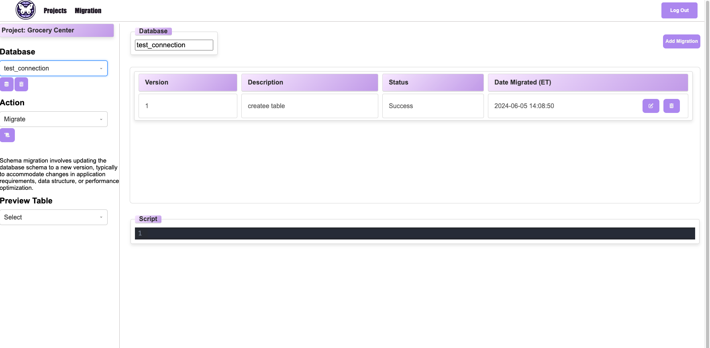

# Table of Contents

- Ditto README.md
  - [Product Description](#product-description)
  - [Instruction](#instructions)
  - [Open Source Information](#open-source-information)

# Product Description

Ditto is a database schema migration version controller. It's intended use is for developers to work collaboritively and help maintain database changes and see what schema migration scripts were executed.
It allows for organization in for multiple projects and databases within those projects. This is the perfect visual tool for engineers who need to keep track of schema migrations so databases are functional and applications work properly before production.

  

  
  

  

  
  

  

  
  

# Important Feautures

- Version Control
- Multiple projects and databases
- Role Based Access
- Code Editor has built in intellisense for writing SQL Scripts

# Instructions

Installation

- No installation necessary (Web Browser App)

Initial Setup

1. Sign up for an account (can be found through the "Get Started" or Sign Up link in the "Sign In" page).
   - You can sign up with Github as well!
2. Login and go to the the projects tab.

Creating a project and connecting your databases (only owners and admins can connect databases to a project).

1. In the left side panel on the projects page you can create a project with the buttons underneath "Choose Project".
2. You can now select the migrations tab in the top navigation bar and press the database icon to create a new database. You will need your connection string and database name here and click the add button.
3. Congrats your database is good to go!

Adding members, kicking members and updating roles for members.
(Only Owner and Admin roles will have these functions)

1. Adding team members:

   1. In the projects page, after selecting a project you can click generate and that code will be stored to that specific project. **_ Only Owner and Admin roles will be able to generate access codes _**
   2. Give the code to members you want to give access to your project and its databases.
   3. Members will now sign up on Ditto as well and when they get to the projects page, they will click join project and enter the access code.
   4. If successful, they should be able to see the project and see themselves as "User" role.

2. Kicking project members:

   1. Select your project in the drop down bar and you can press the kick button given the user row to kick the member.

3. Updating project member roles:
   1. Same thing but as kicking but you can use the drop down bar to set user roles.

Adding, updating and deleting migration scripts.

1. Adding:

   1. In your migrations page you can click the add button above the migration scripts table.
   2. This will take you to the add migrations page and you can enter your version, description and script in the code editor. When you're ready, click add.
   3. You should see your newly made migration under a pending status (will only execute when you're ready).

2. Updates:

   1. If you want to make any updates to version, description or script than you can highlight (should turn purple) the specific migration script you'd like to edit and press the edit icon underneath the code editor.
   2. This will take you to the updates page where you can make your changes.

3. Delete:

   1. If there are any migration scripts you want to delete, you can highlight by clicking a migration script and press the delete button under the code editor.

4. Execute:
   1. Once you're ready to execute, highlight the script that is pending and click execute.
   1. If successful you should see a success status and if not you will see a failed.

Deleting and leaving projects and databases (Only owners and admins can delete and projects and dbs)

1. Deleting projects
   1. Choose project and you can either choose to delete the project or leave. If you delete you will delete the project as a whole in the database. However if you leave the project only you as the user will no longer be attached to the project.
1. Deleting databases
   1. Choose the database and you can click the delete button to erase the database from the project.

Other Documentation:

- PostgreSQL:: https://www.postgresql.org/docs/
- pgAdmin: https://www.pgadmin.org/docs/

## Open Source Information

- Running on dev mode: Make sure to npm build and then run the front with npm run dev and back with npm start.
- Running tests: Using jest. Make sure to npm install and run npm test in the terminal.
- Contribution Guidelines: You can fork from our repo (https://github.com/oslabs-beta/ditto/tree/dev), create your branch and make a pull request whenever you're ready!

| Feature                                                                                                      | Status |
| ------------------------------------------------------------------------------------------------------------ | ------ |
| Role based access                                                                                            | ✅     |
| Migration execution engine                                                                                   | ✅     |
| Maintain state throughout the app                                                                            | ✅     |
| Code editor component with intellisense                                                                      | ✅     |
| No connection string needed for users joining project                                                        | ⏳     |
| Fully integrated typescript, some types are not written yet                                                  | ⏳     |
| Full tests for front and back end. Needs some unit, integration and end to end tests still.                  | ⏳     |
| Give buttons a type so tool tips can explain its functionality, or hover effect like add or delete databases | ⏳     |
| Implement a css framework (like Tailwind) to improve landing page                                            | 🙏🏻     |

- ✅ = Ready to use
- ⏳ = In progress
- 🙏🏻 = Looking for contributors

# Changelog (If Applicable)

**_For Future Iterations_**

# License Information

MIT License

Copyright (c) 2024 Open Source Labs Beta

Permission is hereby granted, free of charge, to any person obtaining a copy of this software and associated documentation files (the "Software"), to deal in the Software without restriction, including without limitation the rights to use, copy, modify, merge, publish, distribute, sublicense, and/or sell copies of the Software, and to permit persons to whom the Software is furnished to do so, subject to the following conditions:

The above copyright notice and this permission notice shall be included in all copies or substantial portions of the Software.

THE SOFTWARE IS PROVIDED "AS IS", WITHOUT WARRANTY OF ANY KIND, EXPRESS OR IMPLIED, INCLUDING BUT NOT LIMITED TO THE WARRANTIES OF MERCHANTABILITY, FITNESS FOR A PARTICULAR PURPOSE AND NONINFRINGEMENT. IN NO EVENT SHALL THE AUTHORS OR COPYRIGHT HOLDERS BE LIABLE FOR ANY CLAIM, DAMAGES OR OTHER LIABILITY, WHETHER IN AN ACTION OF CONTRACT, TORT OR OTHERWISE, ARISING FROM, OUT OF OR IN CONNECTION WITH THE SOFTWARE OR THE USE OR OTHER DEALINGS IN THE SOFTWARE.

# Author Information

<table>
  <tr>
    <td align="center">
      
       
      <b>Jea Lee</b>
       
      <a href="https://www.linkedin.com/in/jealee44">🖇️</a>
      <a href="https://github.com/jealee44">🐙</a>
    </td>
    <td align="center">
      
       
      <b>Jay Cho</b>
       
      <a href="https://www.linkedin.com/in/jaycho1017">🖇️</a>
      <a href="https://github.com/jayc-gh">🐙</a>
    </td>
    <td align="center">
      
       
      <b>Sang Yoon Kim</b>
       
      <a href="https://www.linkedin.com/in/syoonk32">🖇️</a>
      <a href="https://github.com/syjeffkim">🐙</a>
    </td>
    <td align="center">
      
       
      <b>Shaan Khan</b>
       
      <a href="https://www.linkedin.com/in/shaan-m-khan">🖇️</a>
      <a href="https://github.com/shaanmalkovich">🐙</a>
    </td>
  </tr>
</table>
